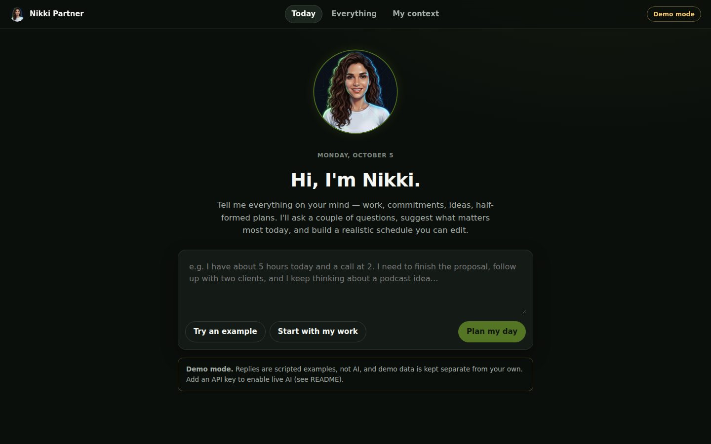
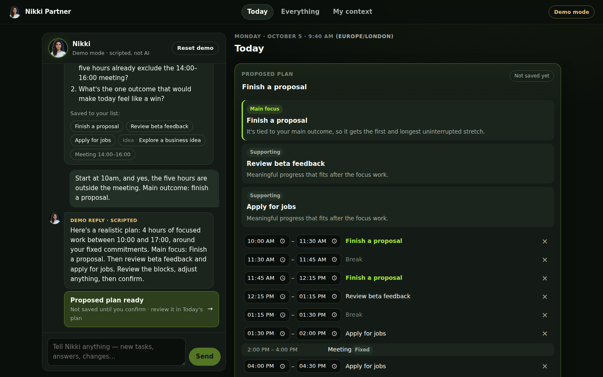
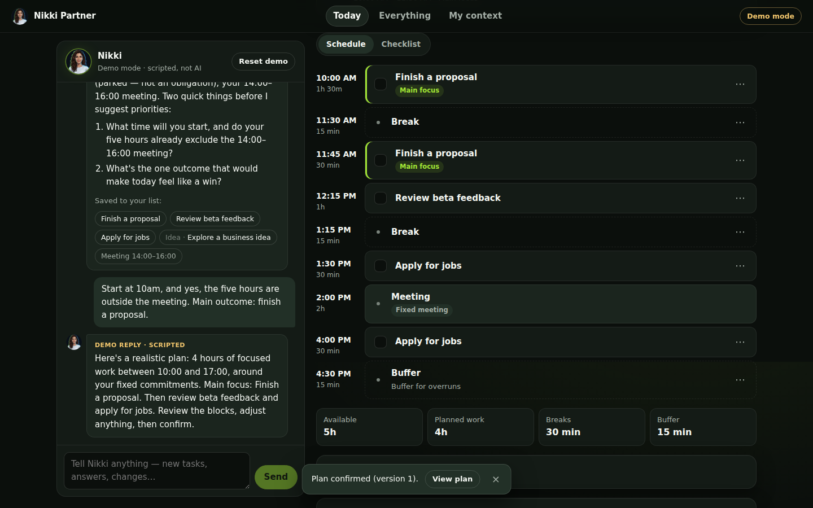
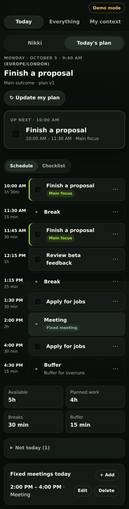

# Nikki Partner

A personal planning partner. You tell Nikki everything on your mind in your own words; she asks a few useful questions, recommends one main focus plus up to two supporting actions, proposes a realistic schedule around your fixed meetings, and updates the plan when you come back.

**Flow:** capture → clarify → propose → confirm → complete → revise.



| Proposal (editable, not saved until you confirm) | Confirmed plan | Mobile |
| --- | --- | --- |
|  |  |  |

- **Frontend:** React + Vite + TypeScript (`src/`)
- **Backend:** Node + Express (`server/`), talking **directly** to the Claude API with the official Anthropic SDK. No n8n, webhooks or workflow platforms.
- **Storage:** SQLite (`data/nikki.db`), survives refreshes and restarts.
- **Demo mode:** works with no API key, using scripted (non-AI) replies and a separate database.

---

## 1. Run it on your computer

You need **Node.js 20 or newer** ([nodejs.org](https://nodejs.org), pick the "LTS" download). To check, open a terminal and run `node -v`.

Run each command in a terminal:

```bash
# 1. Get the code (skip if you already have it)
git clone https://github.com/pcherian89/Nikki_Partner.git
cd Nikki_Partner

# 2. Install dependencies (one time)
npm install

# 3. Create your settings file (one time)
cp .env.example .env        # on Windows PowerShell: copy .env.example .env

# 4. Build the app and start it
npm run build
npm start
```

Then open **http://localhost:3001** in your browser.

With no API key, the app opens in **Demo mode**. Tap **Try an example** to see the whole flow.

To stop the server, press `Ctrl + C` in the terminal. Your data stays in `data/nikki.db`.

**For development** (auto-reload when you edit code): run `npm run dev` and open http://localhost:5173.

**Run the automated tests:** `npm test`

---

## 2. Turn on live AI (your Anthropic API key)

The key stays on the server, in your `.env` file. It is never sent to the browser, and `.env` is excluded from Git.

1. Go to **https://platform.claude.com** and sign in, or create an account.
2. Open **Settings → Billing** and add credit. API usage is billed separately from a Claude.ai subscription.
3. Open **Settings → API keys**, click **Create key**, name it `nikki-partner`, and copy the key (it starts with `sk-ant-`). It is only shown once.
4. Open the `.env` file in the project folder with any text editor and paste the key after the `=` sign:
   ```
   ANTHROPIC_API_KEY=sk-ant-...your key...
   ```
   Save the file. **Never** paste the key into chat, code, or a GitHub file.
5. Stop the server (`Ctrl + C`) and start it again with `npm start`. The terminal should say `Live AI: ON (model claude-opus-5-5)`.
6. In the app, click the badge at the top right (or go to **My context → Mode**) and choose **My workspace · Live AI**.

**Model:** the default is `claude-opus-5-5`, Anthropic's current default Opus model. To change it, set `ANTHROPIC_MODEL` in `.env`, for example `ANTHROPIC_MODEL=claude-sonnet-5-5` for lower cost, and restart.

If something is wrong, the app shows the actual error, such as a rejected key, a rate limit, a timeout, or a network problem. It never silently replaces a failed live reply with a demo reply.

---

## 3. Where the app runs: three different things

| | What it is | Persistent? | Who can open it |
| --- | --- | --- | --- |
| **Claude Code build environment** | The temporary cloud container where this app was built and tested | **No.** It is deleted after the session | Nobody else. It has no public link |
| **Your computer** (`npm start`) | The real app, running locally | Yes, in `data/nikki.db` on your disk | Only you, at `http://localhost:3001` |
| **Hosted deployment** | The app running on a server with a web address | Yes, **only if** the host gives SQLite a durable disk | Anyone with the link, so it **must** have a password |

The Claude Code session couldn't give you a live browser preview link. Use the screenshots above, or run it locally (section 1). That takes about two minutes.

### Hosting it with a link later (not done yet)

Nothing has been deployed and nothing has been purchased. When you're ready, the simplest suitable setup is a single small server with a **persistent volume** for the SQLite file, such as Railway, Render or Fly.io. Each of these can mount a disk. The essentials:

- Set `APP_PASSWORD` to a long, random password. With it set, the app asks for the password before showing any data or calling Claude. This protects your personal data and your paid API key. **Never host it publicly without this.**
- Set `DATABASE_PATH` to a path **on the persistent volume** (for example `/data/nikki.db`). Otherwise your data is wiped on every redeploy.
- Set `ANTHROPIC_API_KEY` in the host's secret/environment settings, not in code.
- Build command: `npm install && npm run build`. Start command: `npm start`. The host provides `PORT`.

Ask me when you want to do this and I'll walk you through one host step by step.

---

## 4. Settings (`.env`)

| Variable | Meaning | Default |
| --- | --- | --- |
| `ANTHROPIC_API_KEY` | Your Claude API key. Empty = Demo mode only | (empty) |
| `ANTHROPIC_MODEL` | Claude model used for planning | `claude-opus-5-5` |
| `DATABASE_PATH` | Personal SQLite file. Demo data goes in `nikki-demo.db` next to it | `./data/nikki.db` |
| `PORT` | Web server port | `3001` |
| `APP_PASSWORD` | Password prompt for the whole app. **Required for public hosting** | (empty = no login) |

---

## 5. How it works

### Views

- **Today:** conversation with Nikki beside today's plan. Shows the main outcome, an obvious "Now / Up next" item, schedule or checklist view, editable time blocks, fixed meetings, a time summary (available, planned work, breaks, buffer), collapsed "Not today", completed tasks with Undo, and **Update my plan**. Each work block has: Need more time (+15/+30), I'm blocked, Move out of today, Move/edit time.
- **Everything:** active actions, waiting/blocked, parked ideas, reference notes, completed. You can add, edit, delete, change status, and deliberately promote an idea into an action.
- **My context:** name, businesses/projects, goals, main outcome, commitments, working hours, timezone and preferences. All fields are optional and editable. This view also has the mode switch, data export, and data deletion.

### What is and isn't automatic

- Opening or refreshing the app **loads saved state only**. It never calls the model.
- Ticking a checkbox crosses the task out immediately and saves it, with an Undo option. If saving fails, the change is rolled back and an error is shown. No model call.
- Nikki's **plan is only a proposal**. You can edit it, and it's saved only when you click **Confirm**. Changes Nikki suggests to existing tasks are also confirmed by you.
- New items and timed meetings **you mention** are saved to your list right away and shown under the reply as "Saved to your list". You can delete them in Everything or Today.
- **Personal facts Nikki infers** (goals, working hours, your name…) appear as "Save to My context?" suggestions. They are never saved without your click.
- **Same-day return:** your confirmed plan is restored. **New day:** if yesterday's plan has unfinished items, Nikki offers to review them first (Keep / Done / Park / Drop).
- **Replanning** asks until when you can keep working. It keeps completed work and fixed meetings, schedules only from now on, shows the changes, and creates a new plan version when you confirm.

### Memory: what is sent to Claude

Memory is stored **by this app** in SQLite. On each request the server sends only:

- Nikki's instructions
- your confirmed context
- relevant open tasks (bounded) and today's done items
- today's meetings
- the current confirmed plan
- the last ~16 messages (character-capped)
- the current date, time, timezone and availability

It does **not** send the whole database. Structured saved facts take precedence over chat history. This is not model training: Claude doesn't remember anything between requests.

### Assistant instructions and response schema

- System instructions: [`server/prompt.ts`](server/prompt.ts) (`SYSTEM_PROMPT`). The per-request context block is built by `buildAppState`.
- Response schema: [`server/schema.ts`](server/schema.ts). It is sent to the API as structured output (`output_config.format`) and re-validated on the server with Zod. The schema is kept small, using `""` and `0` instead of nulls, because the API rejects overly complex schemas. If the API ever rejects the schema anyway, the server switches once to asking for JSON in the instructions, and still validates every reply. Every reply contains:
  - `message`
  - `questions` (≤ 2)
  - `captured_items` (actions / ideas / reference)
  - `task_updates`
  - `meetings`
  - `context_updates`
  - `availability`
  - `plan` (main outcome, focus, ≤ 2 supporting, deferred, window, work budget, time blocks, reasons, assumptions)

### Server-side validation ([`server/validate.ts`](server/validate.ts))

Every proposed or edited plan is checked for:

- valid `HH:MM` times and dates
- valid task references
- no overlapping blocks
- blocks inside the available window
- no overlap with fixed meetings
- meetings not moved
- work time within the confirmed budget, and the budget within the free time
- at most two supporting actions
- no re-scheduling of completed tasks
- for replans, no blocks in the past

If a live reply fails these checks, Claude gets **one** repair attempt with the list of problems. If it still fails, the plan is dropped and Nikki explains why. There are no unlimited retries.

Each confirmed plan is saved as a numbered **version**. A proposal can only be confirmed if the plan hasn't changed since it was made, so stale proposals are rejected. Each message has a client request ID, so double-clicking Send can't create duplicates. Only one model call runs at a time per workspace. The SDK retries once on rate limits and server errors, with a 90-second timeout.

### Model provider

[`server/provider/types.ts`](server/provider/types.ts) defines a small `PlannerProvider` interface. Only Anthropic is implemented ([`server/provider/anthropic.ts`](server/provider/anthropic.ts)). It uses adaptive thinking at `medium` effort, structured output, and Anthropic's server-side refusal fallback (`fallbacks: "default"`).

### Endpoints

`GET /api/state` · `POST /api/messages` · `POST /api/replan` · `POST /api/proposals/:id/confirm|discard` · `POST /api/proposals/:id/suggestions/:sid` · `PUT /api/profile` · `POST/PATCH/DELETE /api/tasks` · `POST/PATCH/DELETE /api/meetings` · `PUT /api/plan` · `POST /api/review` · `GET /api/export` · `DELETE /api/data` · `POST /api/demo/reset`

The workspace is chosen with the `X-Workspace: personal|demo` header. The browser's timezone is sent as `X-Timezone`, and the timezone saved in My context overrides it.

---

## 6. Nikki's avatar

- `public/nikki/nikki-full.webp`: the full-body 3D-style Nikki you provided. It is shown large on the welcome screen with a gentle CSS "breathing" motion, which is switched off for users who prefer reduced motion. The original is kept in `references/nikki-full-reference.webp`.
- `public/nikki/nikki-avatar.png`: a round face crop from the same image, used in the header and chat.
- The first illustration is kept in `references/nikki-reference.png`.

**To replace either image:** save the new file with the same name, then run `npm run build` again. If an image can't load, the app falls back to the round portrait or an "N" monogram, so it never shows a broken image.

## 7. Status: what's verified, simulated and untested

**Verified in the build environment** (automated tests in `server/tests/flow.test.ts` plus a scripted Chromium run):

- production build
- desktop (1440px) and mobile (390px) layouts, with no horizontal scroll on mobile
- the full demo flow: capture → 2 clarifying questions → proposal → confirm → complete → Undo → replan → new version
- persistence after page refresh and after a server restart
- new-day review
- timezone handling
- overlap, meeting, window and budget validation
- stale-proposal and stale-edit rejection
- duplicate and concurrent submissions
- the missing-API-key error
- API failures (rate limit, invalid JSON, invalid plan → one repair attempt), using a fake provider
- export and delete
- demo/personal data separation

**Simulated:**

- **Demo mode** is rule-based. It understands simple phrasing ("5 hours", "2–4 meeting", "I need to A, B and C") and follows a script. It is clearly labelled and is not AI.
- In the automated tests, live-mode behaviour is exercised with a **fake** provider.

**Not yet tested:**

- **Real calls to Claude.** No API key was available in the build environment, so the quality of Nikki's live replies and the exact structured-output behaviour with a real key still need a first run on your machine.
- Real browsers other than Chromium (Safari, Firefox, iOS).
- Hosting on a real host. Password protection was checked locally: requests are rejected without the password and accepted after login.
- Very long histories.
